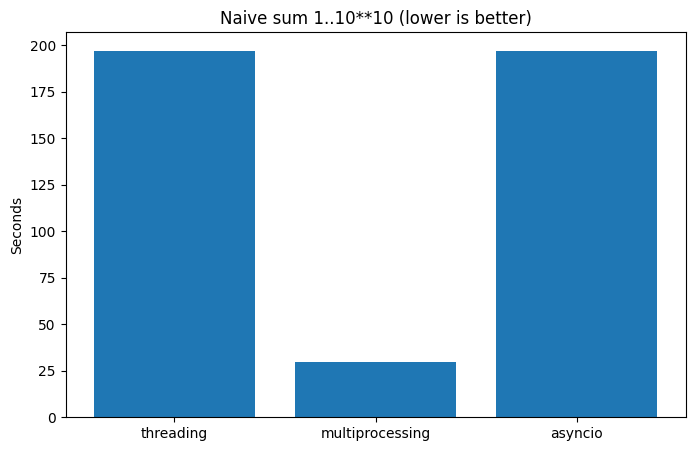

# 📘 Лабораторная работа: сравнение вычислений

Multiprocessing даёт единственный реальный выигрыш, потому что каждый процесс работает на собственном ядре и не делит GIL, поэтому время падает немного больше чем в 6 раз. Threading и asyncio запускают лишь потоки внутри одного процесса, оставаясь под тем же GIL, — отсюда почти идентичные и существенно более длинные времена.

| Подход            | Время, с   |
|-------------------|------------|
| threading         | 196.92     |
| multiprocessing   | 29.72      |
| asyncio           | 197.09     |

