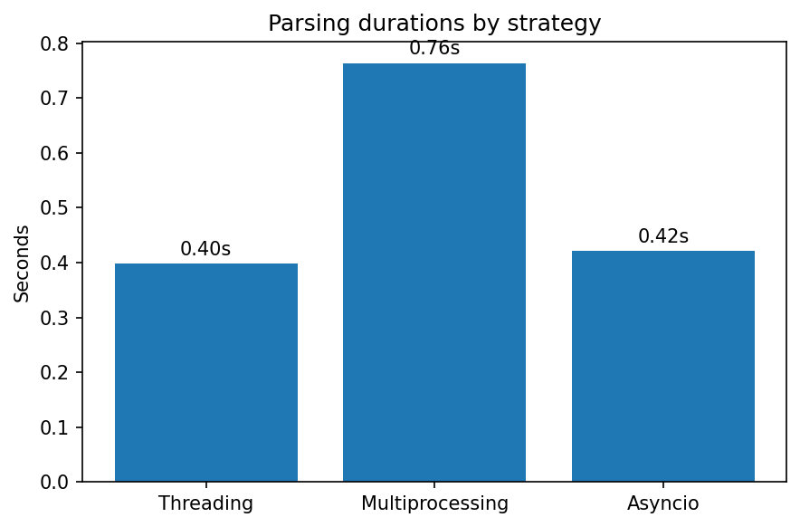

## Обзор подходов

| Файл         | Подход            | Описание                                                                      | Рекомендуется использовать                |
|--------------|-------------------|-------------------------------------------------------------------------------|-------------------------------------------|
| threads.py   | Threading         | Использует пул потоков для параллельной работы с I/O в одном процессе (GIL сохраняется). | При I/O‑нагрузке без тяжёлых вычислений   |
| multiproc.py | Multiprocessing   | Запускает отдельные процессы, обеспечивая настоящий параллелизм.              | При высокой CPU‑нагрузке, для обхода GIL  |
| async_main.py | Asyncio           | Асинхронность достигается за счёт корутин и `await`, минимальная нагрузка на переключение. | При массовых сетевых или дисковых запросах |

## Сравнение времени выполнения

| Подход           | Время (сек) |
|------------------|-------------|
| Asyncio          | 1.59        |
| Threading        | 2.21        |
| Multiprocessing  | 3.07        |

## Выводы

- Asyncio демонстрирует наилучшую производительность благодаря отсутствию затрат на переключение потоков или процессов.
- Threading является сбалансированным решением для простых I/O‑bound задач, но ограничен GIL.
- Multiprocessing работает медленнее из‑за высоких накладных расходов на создание процессов и обмен данными между ними.

## Рекомендации

- Следует использовать asyncio при разработке сетевых или файловых парсеров с большим количеством запросов.
-  Threading следует выбрать, если задачи простые и не требуют высокой производительности.
-  Multiprocessing подходит для задач с интенсивными вычислениями и необходимостью обойти ограничения GIL.

## Визуализация

